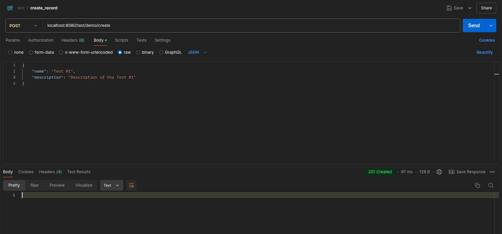
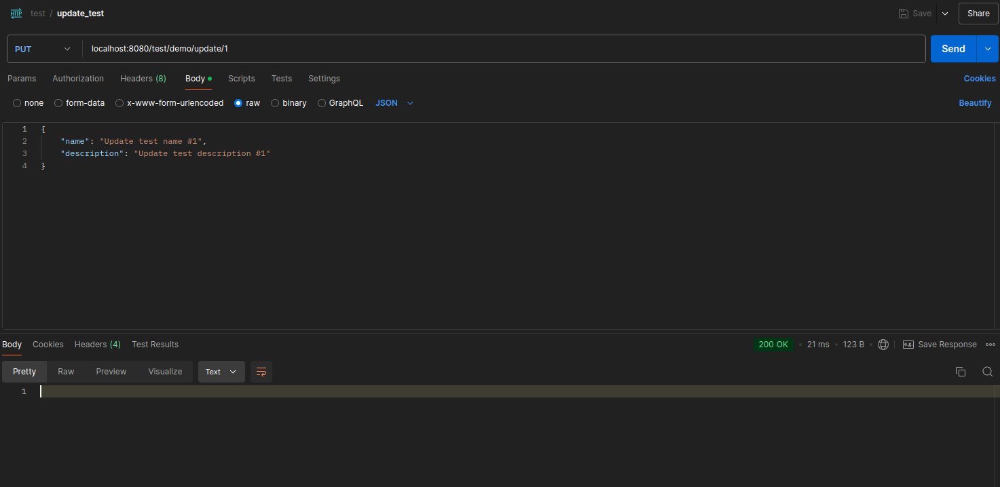
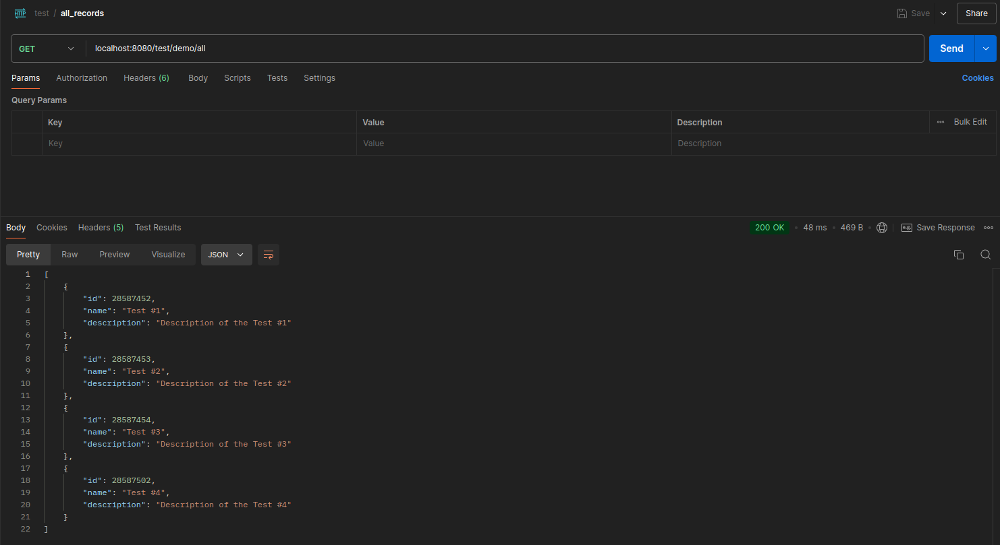
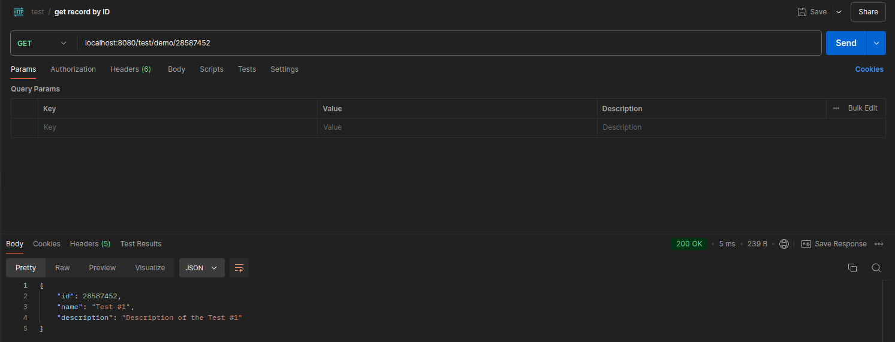
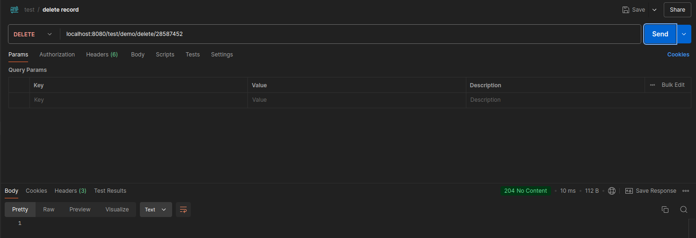
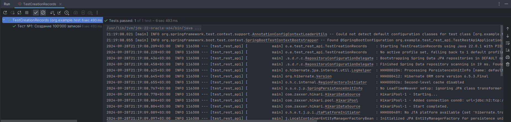
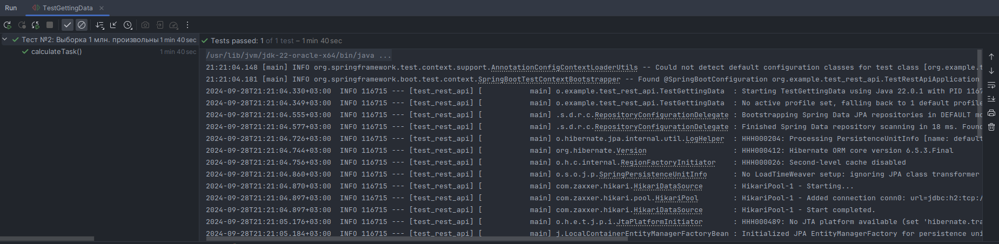

# Тестовое задание НКБИ
Постановка  
Создать Rest API сервис обработки запросов к одной таблице БД.
Сервис должен уметь добавлять новую запись в таблицу, обновлять и удалять запись в таблице по id этой записи.
Должна быть возможность получить одну запись по id.
Должны быть созданы тесты для данного сервиса:
- создание 100тыс новых записей в таблице
- выборка 1млн произвольных записей через 100 подключений со сбором статистики по времени (общее, медианное, 
95 и 99 процентиль)
# Реализация
## Тест запросов
На рисунках ниже приведены скрины работы REST API (через Postman):
1. Создание записи

2. Обновление записи

3. Получение списка всех записей (за кадром было создано несколько записей)

4. Получение записи по её ID

5. Удаление записи


## Работа тестов
1. Тест создания 100'000 записей в базу данных H2

2. Тест выборки 1М произвольных записей через 100 подключений со сбором статистики:

Исходя из результатов теста, были получены следующие результаты:  
```text
Время выполнения (мс): 716
Медиана (мс): 232.0
95 процентиль (мс): 317.0
99 процентиль (мс): 716.0
```